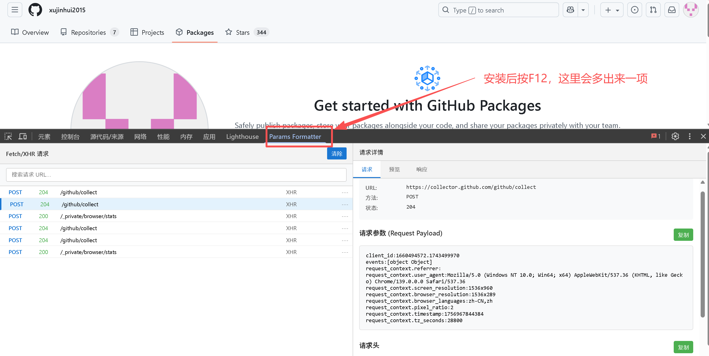

# DevTools Params Formatter

一个模仿 Chrome DevTools 网络面板样式的扩展，专门用于查看和格式化 Fetch/XHR 请求的参数。

## 功能特性

- 🎯 **智能过滤**: 只显示 Fetch/XHR 请求，自动过滤静态资源和页面导航
- 📊 **网络面板样式**: 完全模仿 DevTools 网络面板的界面设计
- 🔍 **详细信息**: 显示请求方法、状态码、URL、大小等信息
- 📝 **参数格式化**: 支持 JSON 和表单数据的 key: value 格式显示
- 🔄 **实时更新**: 自动捕获新的网络请求并更新列表
- 🧹 **一键清除**: 快速清除请求历史记录

## 安装方法

1. 打开 Chrome 浏览器
2. 访问 `chrome://extensions/`
3. 开启右上角的"开发者模式"
4. 点击"加载已解压的扩展程序"
5. 选择包含这些文件的文件夹

## 使用方法

1. 打开 Chrome DevTools (F12)
2. 切换到 "Params Formatter" 标签页
3. 在网页中进行 AJAX 请求或表单提交
4. 左侧面板会显示 Fetch/XHR 请求列表
5. 点击任意请求查看右侧的详细参数信息

## 界面说明

### 左侧请求列表
- **方法**: 显示 HTTP 方法 (GET, POST, PUT 等)
- **状态**: 显示响应状态码
- **名称**: 显示请求的文件名或路径
- **类型**: 显示请求类型 (XHR/fetch)
- **大小**: 显示响应体大小

### 右侧详情面板
- **基本信息**: URL、方法、状态码
- **请求参数**: POST 数据的 key: value 格式显示
- **URL 参数**: 查询字符串参数的格式化显示



## 支持的数据格式

- ✅ JSON 格式的 POST 数据
- ✅ URL 编码的表单数据 (application/x-www-form-urlencoded)
- ✅ URL 查询参数 (Query String)
- ✅ 嵌套对象的扁平化显示

## 文件结构

```
devtools-params-formatter/
├── manifest.json      # 扩展配置文件
├── devtools.html      # DevTools 页面入口
├── devtools.js        # DevTools 脚本，监听网络请求
├── panel.html         # 面板 HTML，模仿网络面板样式
├── panel.js           # 面板逻辑脚本，处理请求显示和参数解析
└── README.md          # 说明文档
```

## 更新日志

### v1.1
- 🎨 重新设计界面，完全模仿 DevTools 网络面板样式
- 🎯 智能过滤，只显示 Fetch/XHR 请求
- 📊 双面板布局，左侧请求列表，右侧详情面板
- 🔍 显示更多请求信息（状态码、大小、类型等）
- 📝 同时支持 POST 数据和 URL 参数的显示

### v1.0
- 基础的参数格式化功能
- 简单的下拉选择界面